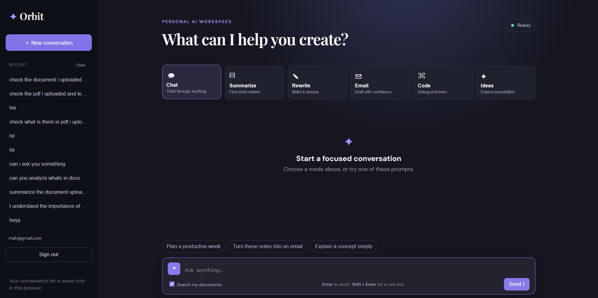

# ✦ Orbit — AI Workspace

A full-stack, multi-mode AI assistant with document-grounded answers (RAG), user accounts, and persistent chat history — built with Flask, Supabase, and Groq.

**Live demo:** https://ai-assistant-dshf.onrender.com/

---

## Features

- 💬 **Six purpose-built assistant modes** — Chat, Summarize, Rewrite, Email, Code, Ideas — each with its own tuned system prompt
- 📄 **Document-grounded answers (RAG)** — upload TXT, MD, CSV, JSON, or PDF files and get answers sourced from their actual content, not just the model's general knowledge
- 🔐 **Real user accounts** — email/password auth via Supabase, with Postgres Row-Level Security so users can never see each other's data
- 🗂️ **Persistent chat history** — conversations are saved per user and can be revisited or cleared
- 📱 **Responsive design** — clean, mobile-friendly UI with no frontend framework (vanilla JS + hand-written CSS)
- ⚡ **Fast inference** — powered by [Groq](https://groq.com)'s LPU inference API

---

## Screenshot



---

## Tech Stack

| Layer           | Technology                                       |
| --------------- | ------------------------------------------------ |
| Backend         | Python 3.11, Flask, Gunicorn                     |
| LLM             | Groq API (`groq/compound-mini`)                  |
| Database & Auth | Supabase (PostgreSQL + Auth), Row-Level Security |
| PDF parsing     | pypdf                                            |
| Frontend        | HTML5, CSS3, vanilla JavaScript (no framework)   |
| Deployment      | Render (`render.yaml` for infra-as-code)         |

---

## Architecture

```
┌─────────────┐      fetch/JSON       ┌──────────────┐        ┌─────────────┐
│   Browser   │ ────────────────────► │  Flask API   │ ─────► │   Supabase  │
│ (vanilla JS)│ ◄──────────────────── │   (main.py)  │ ◄───── │  (Postgres) │
└─────────────┘                       └──────┬───────┘        └─────────────┘
                                              │
                                              ▼
                                        ┌───────────┐
                                        │   Groq    │
                                        │  LLM API  │
                                        └───────────┘
```

**Request flow for a document-grounded question:**

1. Frontend sends the question, mode, chat history, and a `use_documents` flag to `/ask`.
2. If RAG is enabled, the backend retrieves the most relevant chunks of the user's uploaded documents using keyword-overlap scoring (with a fallback to recent uploads for vague questions).
3. Retrieved context is injected into the system prompt, explicitly marked as untrusted reference material (prompt-injection defense).
4. The composed prompt is sent to Groq; the response is saved to the conversation history and returned to the client.

---

## Getting Started

### Prerequisites

- Python 3.11+
- A [Supabase](https://supabase.com) project
- A [Groq](https://console.groq.com) API key

### 1. Clone the repo

```bash
git clone https://github.com/arish-77/ai-assistant.git
cd ai-assistant
```

### 2. Install dependencies

```bash
python -m venv venv
source venv/bin/activate  # Windows: venv\Scripts\activate
pip install -r requirements.txt
```

### 3. Set up the database

In your Supabase project's SQL Editor, run the contents of [`schema.sql`](./schema.sql) once. This creates the `documents`, `document_chunks`, `conversations`, and `messages` tables with Row-Level Security policies enabled.

### 4. Configure environment variables

Create a `.env` file in the project root:

```env
groq_api_key=your_groq_api_key
FLASK_SECRET_KEY=a_long_random_string
SUPABASE_URL=https://your-project.supabase.co
SUPABASE_PUBLISHABLE_KEY=your_supabase_anon_key
SUPABASE_SERVICE_ROLE_KEY=your_supabase_service_role_key
```

> ⚠️ Never commit `.env` — it's already listed in `.gitignore`. The service role key in particular bypasses Row-Level Security and must stay server-side only.

### 5. Run locally

```bash
python main.py
```

Visit `http://localhost:5000`.

---

## Deployment (Render)

This repo includes a `render.yaml` for infra-as-code deployment:

1. Push your repo to GitHub.
2. On [Render](https://render.com), click **New → Web Service** and connect this repo. Render will auto-detect `render.yaml`.
3. In the service's **Environment** tab, add the same variables listed in step 4 above.
4. Deploy — Render builds with `pip install -r requirements.txt` and runs `gunicorn main:app`.

---

## Project Structure

```
.
├── main.py              # Flask app: routes, auth, RAG retrieval, Groq integration
├── templates/
│   └── index.html       # Single-page frontend (vanilla JS)
├── static/
│   └── style.css        # Styling
├── schema.sql            # Postgres schema + RLS policies for Supabase
├── requirements.txt      # Python dependencies
├── runtime.txt            # Pinned Python version
├── render.yaml            # Render deployment config
└── .env                   # Local secrets (not committed)
```

---

## Known Limitations

- Retrieval uses keyword-overlap scoring rather than semantic/embedding-based search — good enough for small personal document sets, but doesn't scale to large or loosely-worded corpora.
- No automated test suite yet.
- No rate limiting on `/ask`, so it's not hardened against abuse if publicly exposed at scale.
- Responses are returned in full rather than streamed token-by-token.

---

## License

<!-- Add a license, e.g. MIT -->

This project is available under the MIT License. See [LICENSE](./LICENSE) for details.
